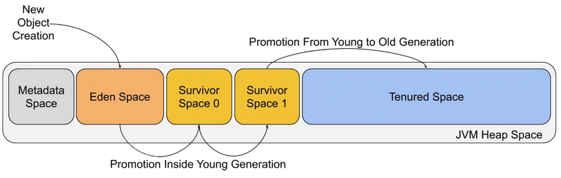

# garbage-collector-game
The intention of the “game” is to simulate process of Garbage Collection (based on Java). 
Your goal is survive as long as possible without crashing program memory. 

This project was created as an entry to the Ludum Dare game jam: 
https://ldjam.com/events/ludum-dare/50/garbage-collector-simulator

# How to run
nodemon index.js

# About garbage collection

> Automatic garbage collection is the process of looking at heap memory, identifying which objects are in use and which are not, and deleting the unused objects. An in use object, or a referenced object, means that some part of your program still maintains a pointer to that object. An unused object, or unreferenced object, is no longer referenced by any part of your program. So the memory used by an unreferenced object can be reclaimed

Source: https://www.oracle.com/webfolder/technetwork/tutorials/obe/java/gc01/index.html

    Minor garbage collection
    Major garbage collection
    Full garbage collection

> Minor garbage collection means that the young generation space clearing event was performed by the JVM. The minor garbage collector will always be triggered when there is not enough memory to allocate a new object on the heap, i.e. when the Eden generation is full or is getting close to being full. If your application creates new objects very often you can expect the minor garbage collector to run often. What you should remember is that during minor garbage collection, when cleaning the Eden and survivor spaces the data is copied entirely which means that no memory fragmentation will happen.

> Major garbage collection means that the tenured generation clearing event was performed. The tenured generation is also widely called the old generation space. Depending on the garbage collector and its settings the tenured generation cleaning may happen less or more often. Which is better? The right answer depends on the use case and we will not be covering it in this blog post.

> Java Full GC means that the full garbage collection event happened. Meaning that both the young and old generation was cleared. The garbage collector tried to clear it and the log tells us what the outcome of that procedure was. Tenured generation cleaning requires mark, sweep, and compact phases to avoid high memory fragmentation. If a garbage collector wouldn’t care about memory fragmentation you could end up in a situation where you have enough memory, but it is fragmented and the object can’t be allocated. We can illustrate this situation with the following diagram:

Source: https://sematext.com/blog/java-garbage-collection-logs/

Tutorial: https://www.oracle.com/technetwork/tutorials/tutorials-1873457.html

# External resources

- https://web.dev/one-line-layouts/
- https://css-tricks.com/snippets/css/a-guide-to-flexbox/#aa-flexbox-properties
- https://www.w3schools.com/css/css3_animations.asp
- https://javascript.info/js-animation
- https://levelup.gitconnected.com/use-javascript-to-make-an-element-follow-the-cursor-3872307778b4
- https://stackoverflow.com/questions/43061417/how-to-listen-for-custom-events-defined-web-component
- https://stackoverflow.com/questions/55001211/how-to-communicate-between-web-components-native-ui
- https://itnext.io/adding-state-to-custom-html-elements-639961c7c529
- https://www.html5rocks.com/en/tutorials/webcomponents/customelements/
- https://stackoverflow.com/questions/35655359/difference-between-template-tags-content-tags-and-custom-element-tags-in-ht
- https://www.w3schools.com/howto/howto_css_modals.asp